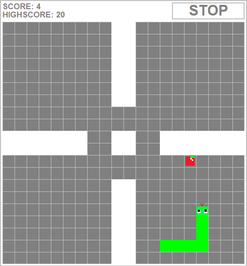

# Snake+ (SnakePlus)

Snake+ was my school project in the second year of high school. It is a simple game made in Java where you play as a snake who eats apples and grows by eating them. If you hit the edge of the map or a wall, you lose.

## Special features

The game comes with a few other features.

### Levels

The game comes with a built-in level creator where you can build your own levels and then play them. You can also share your level with other people by sending them the text file generated by the level creator. The file can be placed in the Levels folder so that the other person can play it as well.

### Shop

By eating apples, you earn credits. You can spend them on snake colors in the shop.